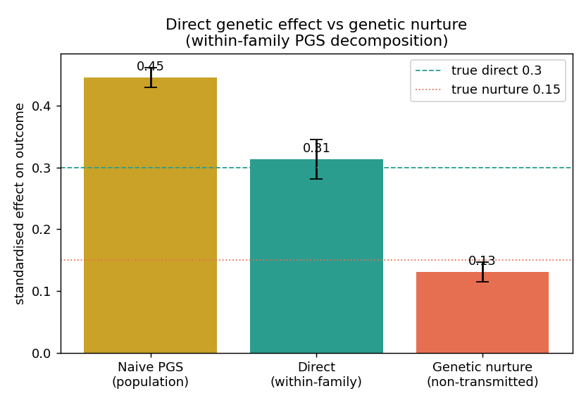

# Within-family PGS: direct genetic effects vs genetic nurture

[](https://doi.org/10.5281/zenodo.20952065)

Application companion for the **Social Science Genetics** PhD position
(VU Amsterdam & Amsterdam UMC, MSCA / GENPOP). It demonstrates the field's
central identification problem and the standard fix, on simulated trios.

## The problem

A polygenic score (PGS) for an outcome like educational attainment predicts the
child's outcome partly because the child's own genes act directly, and partly
because the *parents'* genes shaped the rearing environment — "genetic nurture"
(Kong et al., Science 2018). A naive population PGS regression conflates the two
and overstates how much is "nature".

## The method (and why econometrics transfers)

Split each child's parental alleles into **transmitted** (T, = the child's own
genotype) and **non-transmitted** (NT). Mendelian segregation randomises which
allele is transmitted — a natural experiment. Regressing the outcome on T and NT:

```
coef(NT) = genetic nurture (indirect, parental)
coef(T)  = direct + nurture
direct   = coef(T) - coef(NT)
```

This is an instrumental / natural-experiment design — the same identification
logic used in applied econometrics.

## Result (synthetic, reproducible)

| Estimate | Value | Truth |
|---|---|---|
| Naive population PGS | **0.45** | (conflates both) |
| Within-family direct | **0.31** | 0.30 |
| Genetic nurture (non-transmitted) | **0.13**, p≈7e-16 | 0.15 |

**The naive PGS overstates the direct genetic effect by ~42%.** The within-family
design recovers the true direct effect and shows genetic nurture is real and
significant.



```bash
pip install numpy scipy matplotlib
python3 within_family_demo.py    # -> within_family_results.png, within_family_results.json
```

## Using it on real data

Replace `simulate_trios()` with real transmitted / non-transmitted polygenic
scores (computed from phased trio genotypes + external GWAS weights, e.g. the
educational-attainment GWAS, Lee et al. 2018). The regression and decomposition
are unchanged.

`koellinger_publications.md` — the PI's full bibliography (183 works) for grounding
the application in the group's actual research.

*Generated as an application demo. Synthetic data; method faithful to Kong et al. 2018.*
